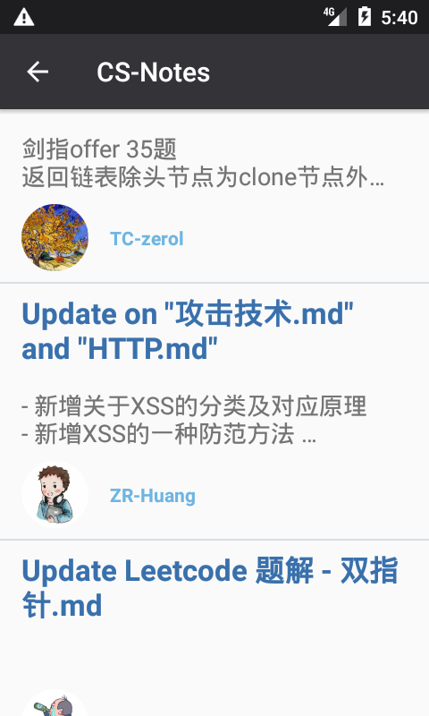

## Descrição Geral

Desafio tecnico da empresa Itau.




## Descrição técnica

### Resumo
Utilizei a arquitetura MVVM, com o uso de Interactors como ponte entre ViewModels (VM) e Repositório (`AppRepository`).
O `AppRepository` representa a abstração do fornecimnto dos dados que serão utilizados pela aplicação. Ele detem a política de decisão sobre como obter o dado. Parte dessa política está delegada ao `NetworkBoundResource`.
Os `Interactors` aplicam regras de negócio transformando os dados que serão utilizados pela `ViewModel`. Os `Interactors` estão padronizados (via `BaseInteractors`) para utilizarem, quando necessário, dos `Coroutines` para realização de suas tarefas assíncronas, como obter e transformar dados.
Apenas para a primeira tela (de listagem de repositórios) não se utilizou interactors, para diminuição da complexidade relacionada à uma solução de paginação.
Para a paginação, utilizou-se um conjunto de soluções do Android Architecture Components chamado Paging Library (https://developer.android.com/topic/libraries/architecture/paging)


### Principais BiBliotecas

- **Retrofit 2**: Para consultas http;

- **Room**: Para persistência simples de dados

- **Coroutines**: Para assincronicidade com melhor leitura de código (sem callbacks)

- **Android Architecture Components**: Utilização de Viewmodel e Livedata
  para exibir e manter os dados utilizados pela View de maneira segura
  com o ciclo de vida das Activities


## Testes

Os testes utilizam o buildtype ```instrumentation``` para funcionar, pois forçamos que o app seja buildado para apontar para localhost durante os testes.

## Acessibilidade

Para teste de acessibilidade, utilizar o recurso de Talkback de um dispositivo Android físico.

## Itens não realizados

- Injeção de dependência
 